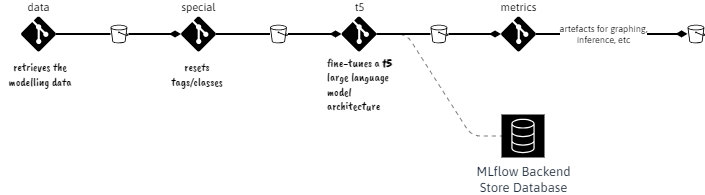
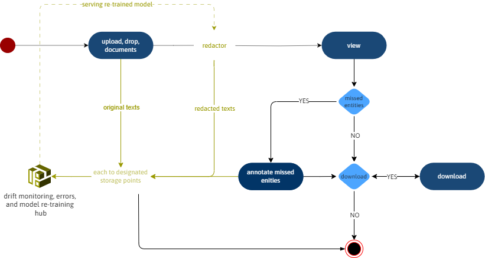

<br>

This hub hosts the repositories of a token classification modelling task in development.  Readers may interact with the latest model via a  <a href="https://greyhypotheses-detecting-eclectic.hf.space/" target="_blank">simple open interface</a>; note, training incomplete, i.e., stopped prematurely.

<br>
<br>

#### Packages/Repositories

<br>

&nbsp; &nbsp; <a href="https://github.com/orgs/prehypotheses/repositories" target="_blank">repositories</a>




<br>
<br>

<table style="width: 80%; margin-left: 1.25rem; margin-right: auto; margin-top: 35px;">
  <colgroup>
    <col span="1" style="width: 21.5%;">
    <col span="1" style="width: 47.5%;">
  </colgroup>
  <tr><td><a href="https://github.com/prehypotheses/data" target="_blank">data</a></td><td>Retrieves the modelling data and delivers it to a depository.</td></tr>
  <tr><td><a href="https://github.com/prehypotheses/special" target="_blank">special</a></td><td>This package resets the tags/classes of the raw modelling <br>data.</td></tr>
<tr><td><a href="https://github.com/prehypotheses/t5" target="_blank">t5</a></td><td>Fine-tunes a T5 large language model architecture for token <br>classification purposes, vis-à-vis the aforementioned data.  At <br> present, it is associated with a <a href="https://mlflow.org/docs/latest/ml/tracking/backend-stores">MLflow Backend Store Database</a></td></tr>
<tr><td><a href="https://github.com/prehypotheses/metrics" target="_blank">metrics</a></td><td>Evaluates the results of one or more fine-tuning packages.  It <br>selects the best for inference, etc., purposes.</td></tr>
<tr><td><a href="https://github.com/prehypotheses/configurations" target="_blank">configurations</a></td><td>Hosts overarching and repository/package specific configurations; <a href="https://github.com/prehypotheses/configurations" target="_blank">README</a> notes.  The notes therein also outline <a href="https://github.com/prehypotheses/configurations#github--assets-delivery" target="_blank">automatic delivery of assets to a cloud platform</a>, and <a href="https://github.com/prehypotheses/configurations#cloud-platforms--secure-services-interactions" target="_blank">secure services interactions</a>.</td></tr>
</table>

<br>
<br>

#### Structures

The raw/original Supervised Batch of FEW-NERD is a <a href="https://huggingface.co/docs/datasets/package_reference/main_classes#datasets.DatasetDict" target="_blank">datasets.dataset_dict.DatasetDict</a>. It has three partitions:

```
DatasetDict({
    train: Dataset({
        features: ['id', 'tokens', 'ner_tags', 'fine_ner_tags'],
        num_rows: ...
    })
    validation: Dataset({
        features: ['id', 'tokens', 'ner_tags', 'fine_ner_tags'],
        num_rows: ...
    })
    test: Dataset({
        features: ['id', 'tokens', 'ner_tags', 'fine_ner_tags'],
        num_rows: ...
    })
})
```

Herein, *'ner_tags'* encodes the coarse grain tags/classes, whilst *'fine_ner_tags'* encodes the fine grain tags/classes.  There are 9 distinct coarse grain classes, and 67 distinct fine grain classes.  

The <a href="https://github.com/prehypotheses/special">special</a> repository/package reads-in the raw/original DatasetDict and **creates a new DatasetDict** that focuses on a small selection of tags.  The <a href="https://d3ju6iarczw32h.cloudfront.net/src/c-eclectic-data-profiles.html" target="_blank">online hub</a> automatically outlines the selection of tags in focus.  **Within the new  DatasetDict** the selection of tags are stored in field named 'fine_ner_tags', and the structure of <a href="https://github.com/prehypotheses/special">special's</a> output is

```
DatasetDict({
    train: Dataset({
        features: ['id', 'tokens', 'fine_ner_tags'],
        num_rows: ...
    })
    validation: Dataset({
        features: ['id', 'tokens', 'fine_ner_tags'],
        num_rows: ...
    })
    test: Dataset({
        features: ['id', 'tokens', 'fine_ner_tags'],
        num_rows: ...
    })
})
```

The tokenization class of the <a href="https://github.com/prehypotheses/t5/tree/master">T5</a> repository/package expects the structure above.


Each partition is a <a href="https://huggingface.co/docs/datasets/package_reference/main_classes#datasets.Dataset" target="_blank">datasets.arrow_dataset.Dataset</a>, and its structure has a pattern akin to

```
{'id': ['13487', '24698'], 'tokens': [['Salbutamol', ',', 'also', 'known', 'as', 'albuterol', 'and', 'marketed', 'as', 'Ventolin', 'among', 'other', 'brand', 'names', ',', 'is', 'a', 'medication', 'that', 'opens', 'up', 'the', 'medium', 'and', 'large', 'airways', 'in', 'the', 'lungs', '.'], ['Under', 'its', 'cultural', 'sponsorship', 'program', ',', 'Kärcher', 'has', 'supported', 'more', 'than', '90', 'projects', 'to', 'clean', 'internationally', 'prominent', 'buildings', 'such', 'as', 'the', 'National', 'Monument', 'in', 'Jakarta', '(', '2014', ')', ',', 'the', 'London', 'Eye', 'in', 'London', '(', '2013', ')', ',', 'the', 'Space', 'Needle', 'in', 'Seattle', '(', '2008', ')', ',', 'the', 'Presidents', '’', 'heads', 'at', 'the', 'Mount', 'Rushmore', 'National', 'Memorial', '(', '2005', ')', ',', 'the', 'Colossi', 'of', 'Memnon', 'in', 'Luxor', '(', '2003', ')', ',', 'the', 'Colonnades', 'on', 'St', 'Peter', '’', 's', 'Square', 'in', 'Rome', '(', '1998', ')', ',', 'the', 'Brandenburg', 'Gate', 'in', 'Berlin', '(', '1990', ')', 'the', 'Statue', 'of', 'Liberty', 'in', 'New', 'York', 'City', '(', '1985', ')', 'and', 'the', 'Statue', 'of', 'Christ', 'in', 'Rio', 'de', 'Janeiro', '(', '1980', ')', '.']], 'fine_ner_tags': [[0, 0, 0, 0, 0, 0, 0, 0, 0, 0, 0, 0, 0, 0, 0, 0, 0, 0, 0, 0, 0, 0, 0, 0, 0, 0, 0, 0, 0, 0], [0, 0, 0, 0, 0, 0, 6, 0, 0, 0, 0, 0, 0, 0, 0, 0, 0, 0, 0, 0, 0, 2, 2, 0, 4, 0, 0, 0, 0, 0, 2, 2, 0, 4, 0, 0, 0, 0, 0, 2, 2, 0, 4, 0, 0, 0, 0, 0, 1, 1, 1, 0, 0, 2, 2, 2, 2, 0, 0, 0, 0, 0, 1, 1, 1, 0, 4, 0, 0, 0, 0, 0, 1, 0, 2, 2, 2, 2, 2, 0, 4, 0, 0, 0, 0, 0, 1, 1, 0, 4, 0, 0, 0, 0, 1, 1, 1, 0, 4, 4, 0, 0, 0, 0, 0, 0, 1, 1, 1, 0, 4, 4, 4, 0, 0, 0, 0]]}
```

Each list of *'tokens'* represents a sentence or paragraph; the corresponding list within *'fine_ner_tags'* encodes the corresponding tags per list.  Note, the numeric codes of *'fine_ner_tags'* map to textual tag/class.

<br>
<br>

#### In Context

At a basic level, we may deploy the token classification model within a setting akin to the one below.  Important considerations

* A named-entity-tagging module; <a href="https://arunmozhi.in/ner-annotator/">an example of an entity recognition tagging tool</a>.
* Colour coded entities with tooltips vis-à-vis underpinning rules, regulations, etc.
* A model fine-tuning & retraining workflow.
* Documents, cases, etc
  * Lineage.
  * Due date alerts.

and

* The wherewithal to continuously evaluate performance via analysis of original redactions & corrected texts.
* Continuous cost analysis.

<br>
<br>

<!--suppress CheckImageSize -->


<br>
<br>

<br>
<br>

The architecture diagram below is <a href="https://docs.aws.amazon.com/wellarchitected/latest/machine-learning-lens/ml-lifecycle-architecture-diagram.html" target="_blank">courtesy of Amazon Web Services</a>.  It expands on the model training/re-training aspects; including the capturing of new data in aid of re-training.

<br>
<br>

<!--suppress CheckImageSize -->


<br>
<br>

<br>
<br>

<br>
<br>

<br>
<br>

<!--

**Here are some ideas to get you started:**

🙋‍♀️ A short introduction - what is your organization all about?
🌈 Contribution guidelines - how can the community get involved?
👩‍💻 Useful resources - where can the community find your docs? Is there anything else the community should know?
🍿 Fun facts - what does your team eat for breakfast?
🧙 Remember, you can do mighty things with the power of [Markdown](https://docs.github.com/github/writing-on-github/getting-started-with-writing-and-formatting-on-github/basic-writing-and-formatting-syntax)
-->
